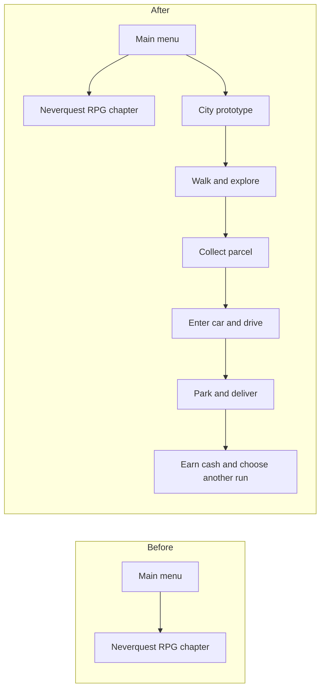
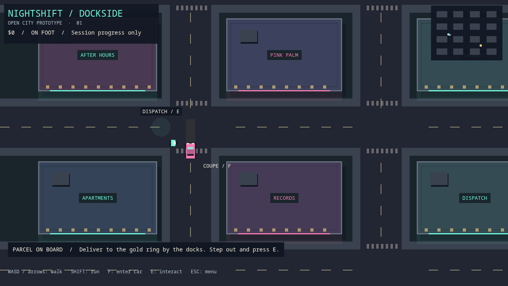
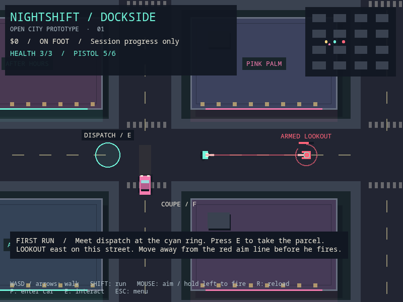
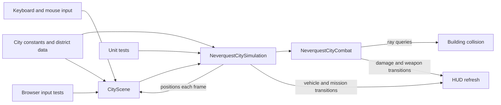

# Open-world city game

## The target

Build a single-player, top-down pixel crime game. The player can explore a connected city, travel on foot or in vehicles, take jobs, enter buildings, fight, escape police, and change their standing with factions.

Use Neverquest as the working game and delivery platform. The user's Hotline projects have been located and inspected; the city combat implementation is original. The setting is provisionally a modern city at night. **Nightshift** and **Dockside** are working names.

## Before and after this milestone

## What is playable now

Open the game and select **City Prototype**. The prototype contains one bounded district with sixteen building footprints, connected streets, walking and running, a coupe with acceleration and steering, safe vehicle exits, collision checks, a minimap, and a delivery job that pays $250. A second job can start at dispatch after the first delivery.

| On foot | In the car |
| --- | --- |
| WASD or arrow keys: walk | W/S or up/down: accelerate and reverse |
| Shift: run | A/D or left/right: steer |
| Mouse: aim; hold left button: fire | Weapons disabled while driving |
| R: reload; R after defeat: retry | The coupe protects its occupant in this prototype |
| F: enter the nearby coupe | Space: brake; F: exit when almost stopped |
| E: collect or deliver a parcel | Exit before interacting with dispatch |
| Escape: return to the menu | Escape: return to the menu |

The street east of dispatch contains one armed lookout. Both characters take three hits. The pistol has six rounds, a one-second reload, and unlimited reserve ammunition. Buildings stop bullets. The lookout marks a fixed aim line before firing; move off that line or take cover. Defeat stops movement and actions. R restores the player, coupe, and lookout while keeping cash and the current parcel. Defeating the lookout clears the encounter until the city is restarted.

Progress lasts for the current visit to the city. The city does not write to the RPG save. Building interiors, traffic, pedestrians, police, audio, and city saves are future work. The map is a fixed district, not a streaming open world. The first control scheme targets desktop browsers; touch and controller support need their own verification.

The temporary visuals are original shapes drawn in Phaser. No code, sprites, maps, music, or branding from Hotline Miami have been imported.

## Technical ownership

- `src/consts/City.ts`: district layout, driving parameters, job data, labels, and colors.
- `src/plugins/NeverquestCitySimulation.ts`: movement, collision queries, vehicle ownership, job state, and cash.
- `src/plugins/NeverquestCityCombat.ts`: pistol, line-of-sight and bullet rays, enemy warning timing, health, reload, and encounter reset. No Phaser dependency.
- `src/scenes/CityScene.ts`: input, rendering, camera, HUD, and scene lifecycle.
- Unit tests cover collision, normalized walking, vehicle entry and exit, blocked exits, braking, delivery ordering, and duplicate rewards.
- Browser tests use the menu and keyboard to walk, pick up a parcel, drive, brake, exit, deliver, resize, and restart. Arrival is positioned directly for the delivery assertion; this test does not claim to drive the whole route.
- Combat tests cover aim validation, cooldown, ammo, reload, building cover, locked enemy aim, dodging, driving protection, defeat, and retry. Browser tests aim with a resized and scrolled camera, shoot, reload, suffer defeat, and retry through real inputs.

Mission and vehicle transitions happen on explicit input. Physics overlaps must not own those flags. Keep simulation code independent of Phaser so future traffic, police, and persistence rules can be tested without a browser.

## Reuse plan

| Area | Existing source | Next decision |
| --- | --- | --- |
| Engine and delivery | Neverquest Phaser, TypeScript, web build, CI, browser harness | Keep the current engine for the prototype |
| Combat | Original `NeverquestCityCombat` | Playtest aim, warning duration, and damage before adding weapons or enemy types |
| Missions | Neverquest story flags and quest state machine | Reuse concepts and events; define a separate city save schema |
| Maps | Existing Tiled maps and map-loading tools | Establish an urban tileset and export one designed district |
| Art | Original temporary city shapes; Hotline visual reference | Establish an original urban tileset and record asset origins |
| Audio | Existing sound integration | Create or source a distinct city ambience, effects, and soundtrack |
| Platforms | Browser, Electron, Capacitor configuration | Prove desktop browser play first; validate each packaged platform later |

Owning a fork does not establish the origin of every included asset. The fork audit must record its engine, dependencies, build status, code license, and asset sources before choosing imports. If engines differ, port isolated behavior and data where useful. Do not combine two engine runtimes just to share code.

### Hotline inspection (September 2026)

On `home@192.168.8.165`, `~/repos/HotlineMiami.gmx` includes a Phaser/TypeScript web port. Its type check passed, and its menu, mask selector, and tutorial loaded. A gameplay smoke check was obscured by large white lighting circles and ended in player defeat, so combat was not verified end-to-end. Its README restricts use to non-commercial projects. Existing local edits were preserved; no source or assets were imported.

`~/repos/hotline-miami-phaser` is a separate automated transpilation scaffold whose README describes incomplete gameplay. It is not the foundation for this city build.

## Ordered milestones

Each milestone should produce a build the user can play. Estimates come after its acceptance criteria and assets are known.

Track this implementation in [#82](https://github.com/gwicho38/neverquest/issues/82) and the remaining milestones in [#83](https://github.com/gwicho38/neverquest/issues/83).

| Order | Milestone | Playable acceptance criteria |
| --- | --- | --- |
| 0 | District foundation — this change | Walk, enter a car, drive, deliver, earn cash, and restart without crashes |
| 1 | Combat and city art direction — in progress | Pistol, one lookout, cover, death, and retry delivered in #86. Next: playtest combat feel, add melee, and produce one consistent street and interior art set |
| 2 | Crime and police | Witnesses report an observable offense. Police investigate, chase, and search. Breaking sight and hiding ends the pursuit. Arrest or death gives a clear recovery path |
| 3 | A living neighborhood | Traffic follows lanes and junctions. Pedestrians use sidewalks and react to danger. Building doors lead to interiors. Nearby actors update within a measured frame budget |
| 4 | A persistent game loop | Versioned city saves restore cash, vehicle, position, and mission progress. Add a safehouse, shop, repair, and three distinct jobs. Invalid saves recover safely |
| 5 | A connected city | Add authored districts, map transitions or streaming, persistent entity IDs, garages, and district-specific missions. Travel across boundaries without duplicated actors or lost progress |
| 6 | An alpha worth sharing | Replace temporary art. Add sound, music, settings, rebinding, controller support, accessibility options, onboarding, performance tests, and a complete short campaign |

## How we build toward it

1. **Design:** Write one short specification for the next playable behavior. Use a control description and a concrete success case.
2. **Engineering:** Build the smallest complete loop. Test state rules first, then wire the scene, input, art, and sound.
3. **Art and maps:** Maintain a palette, pixel scale, collision convention, and source ledger. Author one polished block before producing many blocks.
4. **Content:** Store mission stages, rewards, dialogue, spawns, and map markers as data. Test failure, retry, and save/load paths.
5. **Playtest:** Watch a five-minute session. Record confusing controls, camera problems, weak feedback, and empty stretches. Adjust feel before adding territory.
6. **Release:** Run the unit suite, browser checks, lint, type check, production build, and GitHub CI. Keep each milestone available to play.

## Decisions to resolve with the user

- Confirm modern crime, fantasy, or a hybrid setting.
- Choose an original city art direction using the inspected Hotline projects as visual references.
- Choose the desired combat pace and camera distance through playtesting.
- Select the first release platform after the browser prototype proves the loop.
- Set the art, music, and content budget before commissioning work.

## First milestone implementation notes

The local Node 26 production build exhausted memory during baseline validation. The production build passed with Node 18.16.0 and `NODE_OPTIONS=--max-old-space-size=6144`, using one of this repository's CI Node versions. Keep this environment difference separate from game logic changes.

### Menu resize learning

The menu's background video is optional, but its resize code assumed that a video always existed. A regression test observed `Cannot read properties of null (reading 'setPosition')`. The handler now skips video layout when it is absent. The menu also removes its global scale listener on shutdown, so resizing the city does not call a stopped menu. Scene restarts must clean up listeners held by services that outlive the scene.

The browser playthrough also found that Phaser's video loader throws when the browser cannot decode MP4: it receives no supported URL and dereferences `type` on null. The menu now checks format support before loading the optional video and uses Phaser 3.90's current loader signature. Unit tests cover supported and unsupported codecs. Keep a test that reaches the menu through normal startup; starting gameplay scenes directly would miss this failure.

### Combat input learning

The first browser combat test observed a quick click leaving the lookout at full health. Sampling the held button only during `update()` misses clicks that begin and end between frames. Fire the first shot on `pointerdown`, then use frame updates for held firing with the same simulation cooldown. The browser regression uses a click without an artificial delay. Camera-follow assertions allow pixel-rounding tolerance and derive the target from the actual camera scroll and canvas bounds.
