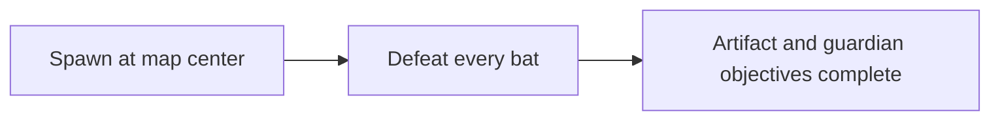
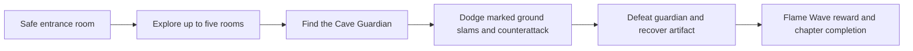

# Chapter 1: Cave Guardian

The cave ends with a dedicated guardian encounter. Ordinary enemies no longer award the artifact or guardian quest flags.

## Before

## After

## Play

Run `mcli run play`, then open the address printed by the development server. Start a new game, speak to the village Elder, and enter the cave portal. Follow the direction hint at the top of the screen.

- Move with WASD or the arrow keys.
- Attack with J, Space, or the left mouse button. Hold K to block.
- The character carries a visible Knight's Shield. It follows facing direction and raises while blocking. Both poses are scaled down by 30% from the initial attachment size; blocking strength is unchanged.
- Leave the red circle before the ground slam. Its position locks when it appears.
- Attack during the guardian's recovery. At half health, its attacks become faster.
- Defeat the guardian to recover the artifact. The chapter ending identifies the unlocked Flame Wave spell; hold L to open the spell wheel.

Encounter timing, balance, and text are in `src/consts/ChapterOne.ts`. The guardian controller owns its attack cycle and cancels its timers when the guardian dies or the scene stops. Damage uses the existing combat manager, including shield reduction and player death handling.

## Regression notes

- A generated map's center can be solid. Spawn at the center of the entrance room instead.
- An ordinary enemy defeat must never stand in for a named boss defeat.
- Keep combat warnings clear of the HUD's game log.
- Reveal fog at spawn and update it as the player moves. Render combat warnings above the fog layer.
- Pause combat during chapter completion and stop the paused dungeon when the player returns to the village.
- Remove player update listeners on destruction and ignore attachment updates after animation teardown.
- Browser attack tests must enter gameplay from the main menu before waiting for a player.

## Checks

Unit tests cover warning timing, evasion, invulnerability, line of sight, enrage, victory, scene cleanup, and safe spawning. The Chapter 1 browser test checks a real dungeon, avoids a marked slam, deals lethal damage through the combat manager, verifies the spell unlock, and returns to the village.

`mcli ci preflight` uses the `ci-native` Make target to run lint, formatting, type checks, the full unit suite with coverage, the existing dependency audit policy, and the production build on the host. This avoids downloading action containers for local verification. Use an LTS Node runtime for the production build.
