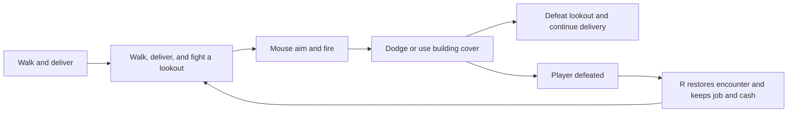

# 0.5.0 — First city combat encounter

## Changes from 0.4.0

- Add mouse aiming, a six-round pistol, held-button firing, and R to reload.
- Add one armed lookout east of dispatch with a visible, locked aim warning before firing.
- Block bullets and enemy perception with building cover. Moving off the warning line dodges a shot.
- Add health, ammo, shot traces, enemy health and minimap markers, and defeat feedback.
- R after defeat restores the encounter, player, and coupe while retaining parcel and cash.
- Disable weapons and protect the occupant while driving in this prototype.
- Add combat unit and browser coverage, including mouse coordinates after camera scrolling and resizing.
- Record the inspection of the two Hotline projects. No Hotline code or assets were imported.

## Scope

One stationary enemy and one pistol establish the combat loop. Melee, patrols, police, weapon pickups, audio, and persistent city saves remain on [the roadmap](../design/open-world-city.md).
